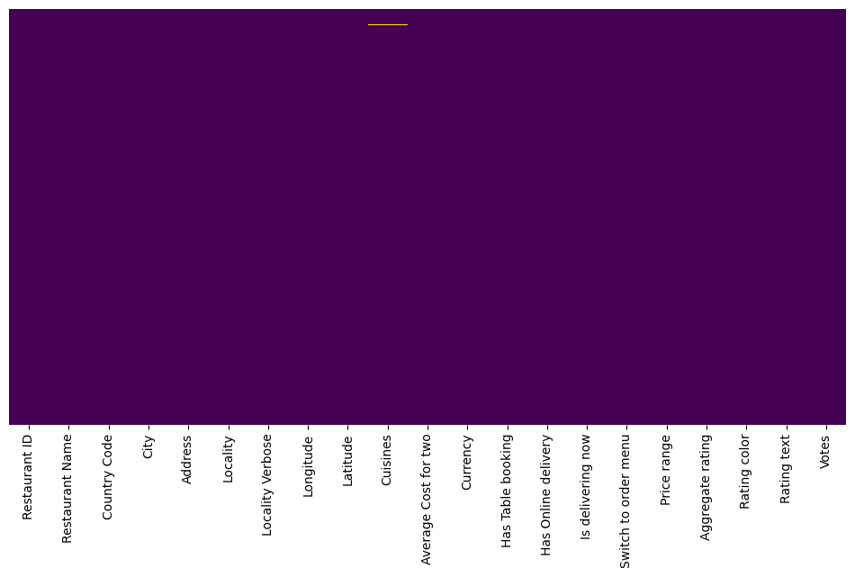
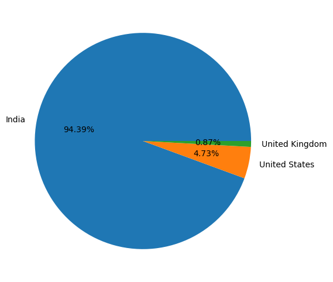
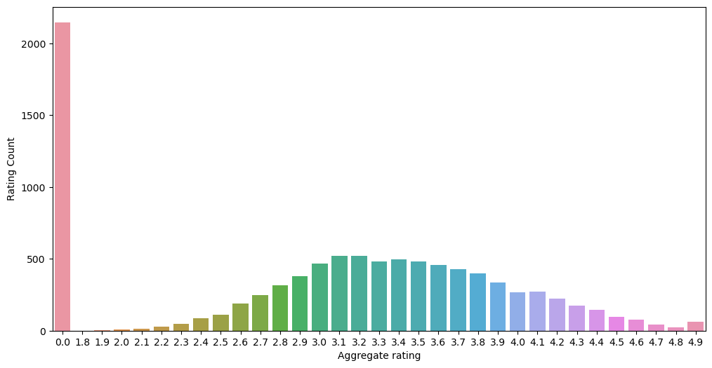
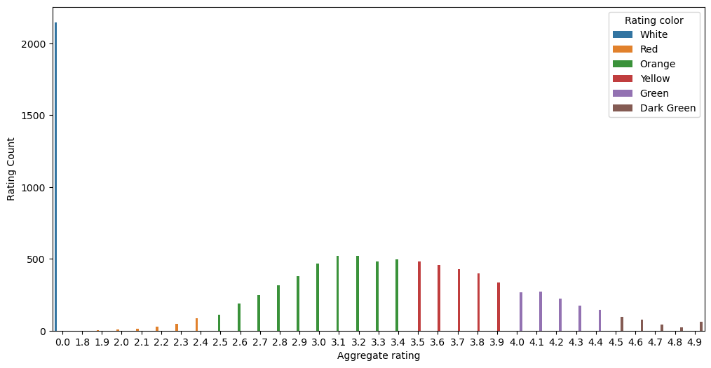
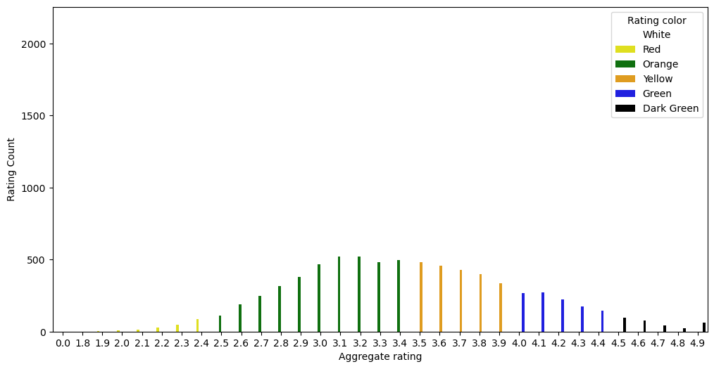
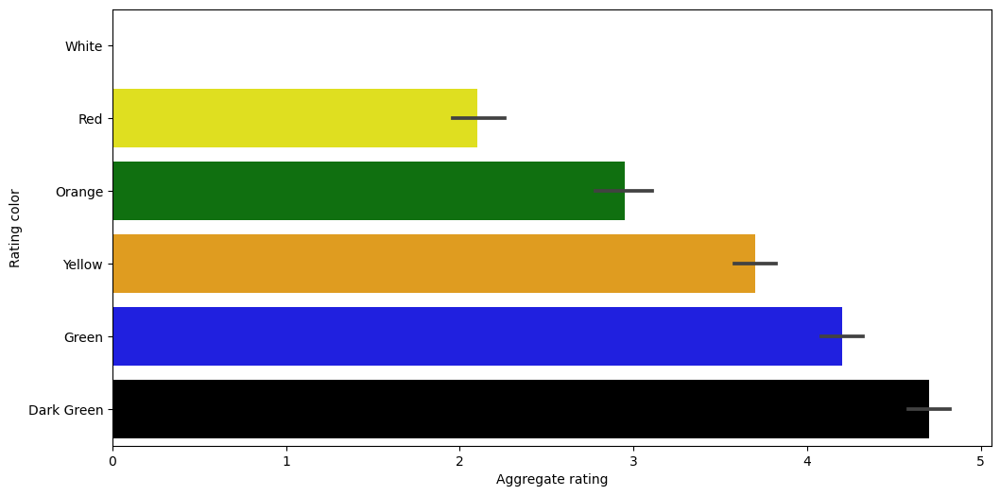
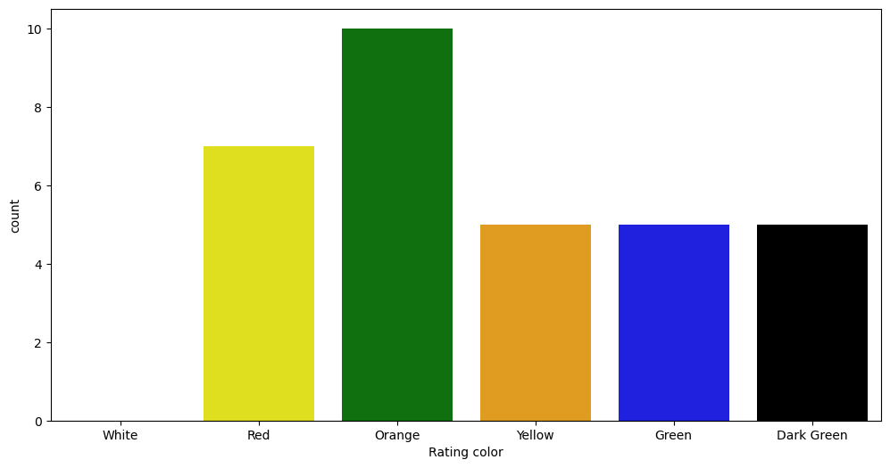
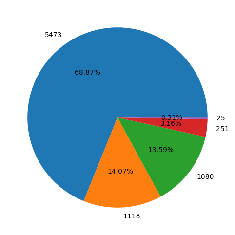

# <p style="background-color:#3A1A2F;font-family:newtimeroman;color:#FFFFFF;font-size:150%;text-align:center;border-radius:10px 10px;">Exploratory Data analysis</p>


### <p style="background-color:#3A1A2F;font-family:newtimeroman;color:#FFFFFF;font-size:150%;text-align:center;border-radius:10px 10px;">Import Libraries</p>


```python
import numpy as np
import pandas as pd
import matplotlib.pyplot as plt
import seaborn as sns
```

#### <p style="background-color:#3A1A2F;font-family:newtimeroman;color:#FFFFFF;font-size:150%;text-align:center;border-radius:10px 10px;">Presented By- Rutuja Satakar</p>


```python
df = pd.read_csv("D:\Data analytica projects\pyhton project class\zomato.csv", encoding ='latin-1')
df.head(10)
```


<div>
<style scoped>
    .dataframe tbody tr th:only-of-type {
        vertical-align: middle;
    }

    .dataframe tbody tr th {
        vertical-align: top;
    }

    .dataframe thead th {
        text-align: right;
    }
</style>
<table border="1" class="dataframe">
  <thead>
    <tr style="text-align: right;">
      <th></th>
      <th>Restaurant ID</th>
      <th>Restaurant Name</th>
      <th>Country Code</th>
      <th>City</th>
      <th>Address</th>
      <th>Locality</th>
      <th>Locality Verbose</th>
      <th>Longitude</th>
      <th>Latitude</th>
      <th>Cuisines</th>
      <th>...</th>
      <th>Currency</th>
      <th>Has Table booking</th>
      <th>Has Online delivery</th>
      <th>Is delivering now</th>
      <th>Switch to order menu</th>
      <th>Price range</th>
      <th>Aggregate rating</th>
      <th>Rating color</th>
      <th>Rating text</th>
      <th>Votes</th>
    </tr>
  </thead>
  <tbody>
    <tr>
      <th>0</th>
      <td>6317637</td>
      <td>Le Petit Souffle</td>
      <td>162</td>
      <td>Makati City</td>
      <td>Third Floor, Century City Mall, Kalayaan Avenu...</td>
      <td>Century City Mall, Poblacion, Makati City</td>
      <td>Century City Mall, Poblacion, Makati City, Mak...</td>
      <td>121.027535</td>
      <td>14.565443</td>
      <td>French, Japanese, Desserts</td>
      <td>...</td>
      <td>Botswana Pula(P)</td>
      <td>Yes</td>
      <td>No</td>
      <td>No</td>
      <td>No</td>
      <td>3</td>
      <td>4.8</td>
      <td>Dark Green</td>
      <td>Excellent</td>
      <td>314</td>
    </tr>
    <tr>
      <th>1</th>
      <td>6304287</td>
      <td>Izakaya Kikufuji</td>
      <td>162</td>
      <td>Makati City</td>
      <td>Little Tokyo, 2277 Chino Roces Avenue, Legaspi...</td>
      <td>Little Tokyo, Legaspi Village, Makati City</td>
      <td>Little Tokyo, Legaspi Village, Makati City, Ma...</td>
      <td>121.014101</td>
      <td>14.553708</td>
      <td>Japanese</td>
      <td>...</td>
      <td>Botswana Pula(P)</td>
      <td>Yes</td>
      <td>No</td>
      <td>No</td>
      <td>No</td>
      <td>3</td>
      <td>4.5</td>
      <td>Dark Green</td>
      <td>Excellent</td>
      <td>591</td>
    </tr>
    <tr>
      <th>2</th>
      <td>6300002</td>
      <td>Heat - Edsa Shangri-La</td>
      <td>162</td>
      <td>Mandaluyong City</td>
      <td>Edsa Shangri-La, 1 Garden Way, Ortigas, Mandal...</td>
      <td>Edsa Shangri-La, Ortigas, Mandaluyong City</td>
      <td>Edsa Shangri-La, Ortigas, Mandaluyong City, Ma...</td>
      <td>121.056831</td>
      <td>14.581404</td>
      <td>Seafood, Asian, Filipino, Indian</td>
      <td>...</td>
      <td>Botswana Pula(P)</td>
      <td>Yes</td>
      <td>No</td>
      <td>No</td>
      <td>No</td>
      <td>4</td>
      <td>4.4</td>
      <td>Green</td>
      <td>Very Good</td>
      <td>270</td>
    </tr>
    <tr>
      <th>3</th>
      <td>6318506</td>
      <td>Ooma</td>
      <td>162</td>
      <td>Mandaluyong City</td>
      <td>Third Floor, Mega Fashion Hall, SM Megamall, O...</td>
      <td>SM Megamall, Ortigas, Mandaluyong City</td>
      <td>SM Megamall, Ortigas, Mandaluyong City, Mandal...</td>
      <td>121.056475</td>
      <td>14.585318</td>
      <td>Japanese, Sushi</td>
      <td>...</td>
      <td>Botswana Pula(P)</td>
      <td>No</td>
      <td>No</td>
      <td>No</td>
      <td>No</td>
      <td>4</td>
      <td>4.9</td>
      <td>Dark Green</td>
      <td>Excellent</td>
      <td>365</td>
    </tr>
    <tr>
      <th>4</th>
      <td>6314302</td>
      <td>Sambo Kojin</td>
      <td>162</td>
      <td>Mandaluyong City</td>
      <td>Third Floor, Mega Atrium, SM Megamall, Ortigas...</td>
      <td>SM Megamall, Ortigas, Mandaluyong City</td>
      <td>SM Megamall, Ortigas, Mandaluyong City, Mandal...</td>
      <td>121.057508</td>
      <td>14.584450</td>
      <td>Japanese, Korean</td>
      <td>...</td>
      <td>Botswana Pula(P)</td>
      <td>Yes</td>
      <td>No</td>
      <td>No</td>
      <td>No</td>
      <td>4</td>
      <td>4.8</td>
      <td>Dark Green</td>
      <td>Excellent</td>
      <td>229</td>
    </tr>
    <tr>
      <th>5</th>
      <td>18189371</td>
      <td>Din Tai Fung</td>
      <td>162</td>
      <td>Mandaluyong City</td>
      <td>Ground Floor, Mega Fashion Hall, SM Megamall, ...</td>
      <td>SM Megamall, Ortigas, Mandaluyong City</td>
      <td>SM Megamall, Ortigas, Mandaluyong City, Mandal...</td>
      <td>121.056314</td>
      <td>14.583764</td>
      <td>Chinese</td>
      <td>...</td>
      <td>Botswana Pula(P)</td>
      <td>No</td>
      <td>No</td>
      <td>No</td>
      <td>No</td>
      <td>3</td>
      <td>4.4</td>
      <td>Green</td>
      <td>Very Good</td>
      <td>336</td>
    </tr>
    <tr>
      <th>6</th>
      <td>6300781</td>
      <td>Buffet 101</td>
      <td>162</td>
      <td>Pasay City</td>
      <td>Building K, SM By The Bay, Sunset Boulevard, M...</td>
      <td>SM by the Bay, Mall of Asia Complex, Pasay City</td>
      <td>SM by the Bay, Mall of Asia Complex, Pasay Cit...</td>
      <td>120.979667</td>
      <td>14.531333</td>
      <td>Asian, European</td>
      <td>...</td>
      <td>Botswana Pula(P)</td>
      <td>Yes</td>
      <td>No</td>
      <td>No</td>
      <td>No</td>
      <td>4</td>
      <td>4.0</td>
      <td>Green</td>
      <td>Very Good</td>
      <td>520</td>
    </tr>
    <tr>
      <th>7</th>
      <td>6301290</td>
      <td>Vikings</td>
      <td>162</td>
      <td>Pasay City</td>
      <td>Building B, By The Bay, Seaside Boulevard, Mal...</td>
      <td>SM by the Bay, Mall of Asia Complex, Pasay City</td>
      <td>SM by the Bay, Mall of Asia Complex, Pasay Cit...</td>
      <td>120.979333</td>
      <td>14.540000</td>
      <td>Seafood, Filipino, Asian, European</td>
      <td>...</td>
      <td>Botswana Pula(P)</td>
      <td>Yes</td>
      <td>No</td>
      <td>No</td>
      <td>No</td>
      <td>4</td>
      <td>4.2</td>
      <td>Green</td>
      <td>Very Good</td>
      <td>677</td>
    </tr>
    <tr>
      <th>8</th>
      <td>6300010</td>
      <td>Spiral - Sofitel Philippine Plaza Manila</td>
      <td>162</td>
      <td>Pasay City</td>
      <td>Plaza Level, Sofitel Philippine Plaza Manila, ...</td>
      <td>Sofitel Philippine Plaza Manila, Pasay City</td>
      <td>Sofitel Philippine Plaza Manila, Pasay City, P...</td>
      <td>120.980090</td>
      <td>14.552990</td>
      <td>European, Asian, Indian</td>
      <td>...</td>
      <td>Botswana Pula(P)</td>
      <td>Yes</td>
      <td>No</td>
      <td>No</td>
      <td>No</td>
      <td>4</td>
      <td>4.9</td>
      <td>Dark Green</td>
      <td>Excellent</td>
      <td>621</td>
    </tr>
    <tr>
      <th>9</th>
      <td>6314987</td>
      <td>Locavore</td>
      <td>162</td>
      <td>Pasig City</td>
      <td>Brixton Technology Center, 10 Brixton Street, ...</td>
      <td>Kapitolyo</td>
      <td>Kapitolyo, Pasig City</td>
      <td>121.056532</td>
      <td>14.572041</td>
      <td>Filipino</td>
      <td>...</td>
      <td>Botswana Pula(P)</td>
      <td>Yes</td>
      <td>No</td>
      <td>No</td>
      <td>No</td>
      <td>3</td>
      <td>4.8</td>
      <td>Dark Green</td>
      <td>Excellent</td>
      <td>532</td>
    </tr>
  </tbody>
</table>
<p>10 rows × 21 columns</p>
</div>


# <p style="background-color:#3A1A2F;font-family:newtimeroman;color:#FFFFFF;font-size:100%;text-align:center;border-radius:10px 10px;">Improve our domain Knowledge about Zomato</p> 
### Lets Talks about Zomato and Familiar more about it:

* Zomato has Launched in 2010, its technology platform connects customers, restaurant partners and delivery partners, serving their multiple needs.
* Customers use its platform to search and discover restaurants, read and write customer generated reviews and view and upload photos, order food delivery, book a table and make payments while dining-out at restaurants. 
* On the other hand, it provides restaurant partners with industry-specific marketing tools which enable them to engage and acquire customers to grow their business while also providing a reliable and efficient last mile delivery service.
*Its team also operate a one-stop procurement solution, Hyperpure, which supplies high quality ingredients and kitchen products to restaurant partners. Zomato' team also provide our delivery partners with transparent and flexible earning opportunities.

* In the following code I use encoding = latin-1:<br>

It maps all possible byte values to the first 256 Unicode code points, and thus ensures decoding errors will never occur regardless of the configured error handler</br>
* Use pandas documentation to find and explore whatever you like to search..
https://pandas.pydata.org/docs/

Zomato Restaurant contains the following variables (Columns):


• **Restaurant Id:** Unique id of every restaurant across various cities of the world<br>
• **Restaurant Name:** Name of the restaurant<br>
• **Country Code:** Country in which restaurant is located<br>
• **City:** City in which restaurant is located<br>
•**Address:** Address of the restaurant<br>
• **Locality:** Location in the city<br>
• **Locality Verbose:** Detailed description of the locality<br>
• **Longitude:** Longitude coordinate of the restaurant's location<br>
• **Latitude:** Latitude coordinate of the restaurant's location<br>
• **Cuisines:** Cuisines offered by the restaurant<br>
• **Average Cost for two:** Cost for two people in different currencies<br>
• **Currency:** Currency of the country<br>
• **Has Table booking:** yes/no<br>
• **Has Online delivery:** yes/ no<br>
• **Is delivering:** yes/ no<br>
• **Switch to order menu:** yes/no<br>
• **Price range:** range of price of food<br>
• **Aggregate Rating:** Average rating out of 5<br>
• **Rating color:** depending upon the average rating color<br>
• **Rating text:** text on the basis of rating of rating<br>
• **Votes:** Number of ratings casted by people<br>


```python
# culumns in data 
df.columns
```


    Index(['Restaurant ID', 'Restaurant Name', 'Country Code', 'City', 'Address',
           'Locality', 'Locality Verbose', 'Longitude', 'Latitude', 'Cuisines',
           'Average Cost for two', 'Currency', 'Has Table booking',
           'Has Online delivery', 'Is delivering now', 'Switch to order menu',
           'Price range', 'Aggregate rating', 'Rating color', 'Rating text',
           'Votes'],
          dtype='object')


```python
# you can find data type by info
# Object: Categorical
df.info()
```

    <class 'pandas.core.frame.DataFrame'>
    RangeIndex: 9551 entries, 0 to 9550
    Data columns (total 21 columns):
     #   Column                Non-Null Count  Dtype  
    ---  ------                --------------  -----  
     0   Restaurant ID         9551 non-null   int64  
     1   Restaurant Name       9551 non-null   object 
     2   Country Code          9551 non-null   int64  
     3   City                  9551 non-null   object 
     4   Address               9551 non-null   object 
     5   Locality              9551 non-null   object 
     6   Locality Verbose      9551 non-null   object 
     7   Longitude             9551 non-null   float64
     8   Latitude              9551 non-null   float64
     9   Cuisines              9542 non-null   object 
     10  Average Cost for two  9551 non-null   int64  
     11  Currency              9551 non-null   object 
     12  Has Table booking     9551 non-null   object 
     13  Has Online delivery   9551 non-null   object 
     14  Is delivering now     9551 non-null   object 
     15  Switch to order menu  9551 non-null   object 
     16  Price range           9551 non-null   int64  
     17  Aggregate rating      9551 non-null   float64
     18  Rating color          9551 non-null   object 
     19  Rating text           9551 non-null   object 
     20  Votes                 9551 non-null   int64  
    dtypes: float64(3), int64(5), object(13)
    memory usage: 1.5+ MB
    


```python
# Review descriptive data
df.describe()
```


<div>
<style scoped>
    .dataframe tbody tr th:only-of-type {
        vertical-align: middle;
    }

    .dataframe tbody tr th {
        vertical-align: top;
    }

    .dataframe thead th {
        text-align: right;
    }
</style>
<table border="1" class="dataframe">
  <thead>
    <tr style="text-align: right;">
      <th></th>
      <th>Restaurant ID</th>
      <th>Country Code</th>
      <th>Longitude</th>
      <th>Latitude</th>
      <th>Average Cost for two</th>
      <th>Price range</th>
      <th>Aggregate rating</th>
      <th>Votes</th>
    </tr>
  </thead>
  <tbody>
    <tr>
      <th>count</th>
      <td>9.551000e+03</td>
      <td>9551.000000</td>
      <td>9551.000000</td>
      <td>9551.000000</td>
      <td>9551.000000</td>
      <td>9551.000000</td>
      <td>9551.000000</td>
      <td>9551.000000</td>
    </tr>
    <tr>
      <th>mean</th>
      <td>9.051128e+06</td>
      <td>18.365616</td>
      <td>64.126574</td>
      <td>25.854381</td>
      <td>1199.210763</td>
      <td>1.804837</td>
      <td>2.666370</td>
      <td>156.909748</td>
    </tr>
    <tr>
      <th>std</th>
      <td>8.791521e+06</td>
      <td>56.750546</td>
      <td>41.467058</td>
      <td>11.007935</td>
      <td>16121.183073</td>
      <td>0.905609</td>
      <td>1.516378</td>
      <td>430.169145</td>
    </tr>
    <tr>
      <th>min</th>
      <td>5.300000e+01</td>
      <td>1.000000</td>
      <td>-157.948486</td>
      <td>-41.330428</td>
      <td>0.000000</td>
      <td>1.000000</td>
      <td>0.000000</td>
      <td>0.000000</td>
    </tr>
    <tr>
      <th>25%</th>
      <td>3.019625e+05</td>
      <td>1.000000</td>
      <td>77.081343</td>
      <td>28.478713</td>
      <td>250.000000</td>
      <td>1.000000</td>
      <td>2.500000</td>
      <td>5.000000</td>
    </tr>
    <tr>
      <th>50%</th>
      <td>6.004089e+06</td>
      <td>1.000000</td>
      <td>77.191964</td>
      <td>28.570469</td>
      <td>400.000000</td>
      <td>2.000000</td>
      <td>3.200000</td>
      <td>31.000000</td>
    </tr>
    <tr>
      <th>75%</th>
      <td>1.835229e+07</td>
      <td>1.000000</td>
      <td>77.282006</td>
      <td>28.642758</td>
      <td>700.000000</td>
      <td>2.000000</td>
      <td>3.700000</td>
      <td>131.000000</td>
    </tr>
    <tr>
      <th>max</th>
      <td>1.850065e+07</td>
      <td>216.000000</td>
      <td>174.832089</td>
      <td>55.976980</td>
      <td>800000.000000</td>
      <td>4.000000</td>
      <td>4.900000</td>
      <td>10934.000000</td>
    </tr>
  </tbody>
</table>
</div>


Lets go to find out the number of observations and columns of Zomato Restaurant Dataset.

# In Data Analysis we do:
1. Missing Values
2. Explore about Numerical Valuables
3. Explore about Categorical valuables
4. Finding Relationship Between  Features


```python
df.shape
```


    (9551, 21)


```python
df.isnull().sum()
```


    Restaurant ID           0
    Restaurant Name         0
    Country Code            0
    City                    0
    Address                 0
    Locality                0
    Locality Verbose        0
    Longitude               0
    Latitude                0
    Cuisines                9
    Average Cost for two    0
    Currency                0
    Has Table booking       0
    Has Online delivery     0
    Is delivering now       0
    Switch to order menu    0
    Price range             0
    Aggregate rating        0
    Rating color            0
    Rating text             0
    Votes                   0
    dtype: int64


```python
[features for features in df.columns if df[features].isnull().sum()>0]
```


    ['Cuisines']


#### The value between in 9551 is too small so did not show in heatmap


```python
import matplotlib
matplotlib.rcParams['figure.figsize']=(12,6)
sns.heatmap(df.isnull(), yticklabels =False, cbar=False, cmap= 'viridis')

```


    <AxesSubplot:>


    

    


```python
df_country = pd.read_csv("D:\Data analytica projects\pyhton project class\Pyhton project file.csv")
df_country.head()
```


<div>
<style scoped>
    .dataframe tbody tr th:only-of-type {
        vertical-align: middle;
    }

    .dataframe tbody tr th {
        vertical-align: top;
    }

    .dataframe thead th {
        text-align: right;
    }
</style>
<table border="1" class="dataframe">
  <thead>
    <tr style="text-align: right;">
      <th></th>
      <th>Country Code</th>
      <th>Country</th>
    </tr>
  </thead>
  <tbody>
    <tr>
      <th>0</th>
      <td>1</td>
      <td>India</td>
    </tr>
    <tr>
      <th>1</th>
      <td>14</td>
      <td>Australia</td>
    </tr>
    <tr>
      <th>2</th>
      <td>30</td>
      <td>Brazil</td>
    </tr>
    <tr>
      <th>3</th>
      <td>37</td>
      <td>Canada</td>
    </tr>
    <tr>
      <th>4</th>
      <td>94</td>
      <td>Indonesia</td>
    </tr>
  </tbody>
</table>
</div>


```python
df.columns

```


    Index(['Restaurant ID', 'Restaurant Name', 'Country Code', 'City', 'Address',
           'Locality', 'Locality Verbose', 'Longitude', 'Latitude', 'Cuisines',
           'Average Cost for two', 'Currency', 'Has Table booking',
           'Has Online delivery', 'Is delivering now', 'Switch to order menu',
           'Price range', 'Aggregate rating', 'Rating color', 'Rating text',
           'Votes'],
          dtype='object')


```python
df_country.columns
```


    Index(['Country Code', 'Country'], dtype='object')


## At te moment I merge df, df_country where their country code are the same


```python
#At te moment I merge df, df_country where their country code are the same
Final_df=pd.merge(df, df_country, on= 'Country Code', how= 'left')
Final_df.head(2)
```


<div>
<style scoped>
    .dataframe tbody tr th:only-of-type {
        vertical-align: middle;
    }

    .dataframe tbody tr th {
        vertical-align: top;
    }

    .dataframe thead th {
        text-align: right;
    }
</style>
<table border="1" class="dataframe">
  <thead>
    <tr style="text-align: right;">
      <th></th>
      <th>Restaurant ID</th>
      <th>Restaurant Name</th>
      <th>Country Code</th>
      <th>City</th>
      <th>Address</th>
      <th>Locality</th>
      <th>Locality Verbose</th>
      <th>Longitude</th>
      <th>Latitude</th>
      <th>Cuisines</th>
      <th>...</th>
      <th>Has Table booking</th>
      <th>Has Online delivery</th>
      <th>Is delivering now</th>
      <th>Switch to order menu</th>
      <th>Price range</th>
      <th>Aggregate rating</th>
      <th>Rating color</th>
      <th>Rating text</th>
      <th>Votes</th>
      <th>Country</th>
    </tr>
  </thead>
  <tbody>
    <tr>
      <th>0</th>
      <td>6317637</td>
      <td>Le Petit Souffle</td>
      <td>162</td>
      <td>Makati City</td>
      <td>Third Floor, Century City Mall, Kalayaan Avenu...</td>
      <td>Century City Mall, Poblacion, Makati City</td>
      <td>Century City Mall, Poblacion, Makati City, Mak...</td>
      <td>121.027535</td>
      <td>14.565443</td>
      <td>French, Japanese, Desserts</td>
      <td>...</td>
      <td>Yes</td>
      <td>No</td>
      <td>No</td>
      <td>No</td>
      <td>3</td>
      <td>4.8</td>
      <td>Dark Green</td>
      <td>Excellent</td>
      <td>314</td>
      <td>Phillipines</td>
    </tr>
    <tr>
      <th>1</th>
      <td>6304287</td>
      <td>Izakaya Kikufuji</td>
      <td>162</td>
      <td>Makati City</td>
      <td>Little Tokyo, 2277 Chino Roces Avenue, Legaspi...</td>
      <td>Little Tokyo, Legaspi Village, Makati City</td>
      <td>Little Tokyo, Legaspi Village, Makati City, Ma...</td>
      <td>121.014101</td>
      <td>14.553708</td>
      <td>Japanese</td>
      <td>...</td>
      <td>Yes</td>
      <td>No</td>
      <td>No</td>
      <td>No</td>
      <td>3</td>
      <td>4.5</td>
      <td>Dark Green</td>
      <td>Excellent</td>
      <td>591</td>
      <td>Phillipines</td>
    </tr>
  </tbody>
</table>
<p>2 rows × 22 columns</p>
</div>


```python
#At this step we want to know data types:
Final_df.dtypes
```


    Restaurant ID             int64
    Restaurant Name          object
    Country Code              int64
    City                     object
    Address                  object
    Locality                 object
    Locality Verbose         object
    Longitude               float64
    Latitude                float64
    Cuisines                 object
    Average Cost for two      int64
    Currency                 object
    Has Table booking        object
    Has Online delivery      object
    Is delivering now        object
    Switch to order menu     object
    Price range               int64
    Aggregate rating        float64
    Rating color             object
    Rating text              object
    Votes                     int64
    Country                  object
    dtype: object


### At this step we want to know data types:


```python
print('Here, there is a list of Zomato country:')
for i in pd.unique(Final_df.Country): print(i)
print('Total number of countries is:', len(pd.unique(Final_df.Country)))
```

    Here, there is a list of Zomato country:
    Phillipines
    Brazil
    United States
    Australia
    Canada
    Singapore
    UAE
    India
    Indonesia
    New Zealand
    United Kingdom
    Qatar
    South Africa
    Sri Lanka
    Turkey
    Total number of countries is: 15
    

### Lets go to Explorer Dataset, Lets pick up something
 ##### How many countries are there?


```python
#Lets go to Explorer Dataset, Lets pick up something
#How many countries are there?
Final_df.columns
```


    Index(['Restaurant ID', 'Restaurant Name', 'Country Code', 'City', 'Address',
           'Locality', 'Locality Verbose', 'Longitude', 'Latitude', 'Cuisines',
           'Average Cost for two', 'Currency', 'Has Table booking',
           'Has Online delivery', 'Is delivering now', 'Switch to order menu',
           'Price range', 'Aggregate rating', 'Rating color', 'Rating text',
           'Votes', 'Country'],
          dtype='object')


```python
Final_df.Country.value_counts()
```


    India             8652
    United States      434
    United Kingdom      80
    Brazil              60
    UAE                 60
    South Africa        60
    New Zealand         40
    Turkey              34
    Australia           24
    Phillipines         22
    Indonesia           21
    Singapore           20
    Qatar               20
    Sri Lanka           20
    Canada               4
    Name: Country, dtype: int64


### Maximum Transaction happen in India by 8652


```python
#Maximum Transaction happen in India by 8652
Final_df.Country.value_counts().index
```


    Index(['India', 'United States', 'United Kingdom', 'Brazil', 'UAE',
           'South Africa', 'New Zealand', 'Turkey', 'Australia', 'Phillipines',
           'Indonesia', 'Singapore', 'Qatar', 'Sri Lanka', 'Canada'],
          dtype='object')


```python
country_name = Final_df.Country.value_counts().index
country_name
```


    Index(['India', 'United States', 'United Kingdom', 'Brazil', 'UAE',
           'South Africa', 'New Zealand', 'Turkey', 'Australia', 'Phillipines',
           'Indonesia', 'Singapore', 'Qatar', 'Sri Lanka', 'Canada'],
          dtype='object')


```python
country_val = Final_df.Country.value_counts().values
country_val
```


    array([8652,  434,   80,   60,   60,   60,   40,   34,   24,   22,   21,
             20,   20,   20,    4], dtype=int64)


## Lets do some Plots
#### 1- Top 3 Countries that uses Zomato


```python
#Lets do some Plots
#1- Top 3 Countries that uses Zomato
plt.pie(country_val[:3], labels=country_name[:3],autopct ='%1.2f%%');
```


    

    


#####  Observation:Zomato Maximum Records are from India After that USA and then United Kingdom
#####  How many Variable Are there?


```python
'''Observation:Zomato Maximum Records are from India After that USA and then United Kingdom
How many Variable Are there?'''
Final_df.columns
```


    Index(['Restaurant ID', 'Restaurant Name', 'Country Code', 'City', 'Address',
           'Locality', 'Locality Verbose', 'Longitude', 'Latitude', 'Cuisines',
           'Average Cost for two', 'Currency', 'Has Table booking',
           'Has Online delivery', 'Is delivering now', 'Switch to order menu',
           'Price range', 'Aggregate rating', 'Rating color', 'Rating text',
           'Votes', 'Country'],
          dtype='object')


```python
Final_df.groupby(['Aggregate rating','Rating color','Rating text']).size()
```


    Aggregate rating  Rating color  Rating text
    0.0               White         Not rated      2148
    1.8               Red           Poor              1
    1.9               Red           Poor              2
    2.0               Red           Poor              7
    2.1               Red           Poor             15
    2.2               Red           Poor             27
    2.3               Red           Poor             47
    2.4               Red           Poor             87
    2.5               Orange        Average         110
    2.6               Orange        Average         191
    2.7               Orange        Average         250
    2.8               Orange        Average         315
    2.9               Orange        Average         381
    3.0               Orange        Average         468
    3.1               Orange        Average         519
    3.2               Orange        Average         522
    3.3               Orange        Average         483
    3.4               Orange        Average         498
    3.5               Yellow        Good            480
    3.6               Yellow        Good            458
    3.7               Yellow        Good            427
    3.8               Yellow        Good            400
    3.9               Yellow        Good            335
    4.0               Green         Very Good       266
    4.1               Green         Very Good       274
    4.2               Green         Very Good       221
    4.3               Green         Very Good       174
    4.4               Green         Very Good       144
    4.5               Dark Green    Excellent        95
    4.6               Dark Green    Excellent        78
    4.7               Dark Green    Excellent        42
    4.8               Dark Green    Excellent        25
    4.9               Dark Green    Excellent        61
    dtype: int64


```python
Final_df.groupby(['Aggregate rating','Rating color','Rating text']).size().reset_index()
```


<div>
<style scoped>
    .dataframe tbody tr th:only-of-type {
        vertical-align: middle;
    }

    .dataframe tbody tr th {
        vertical-align: top;
    }

    .dataframe thead th {
        text-align: right;
    }
</style>
<table border="1" class="dataframe">
  <thead>
    <tr style="text-align: right;">
      <th></th>
      <th>Aggregate rating</th>
      <th>Rating color</th>
      <th>Rating text</th>
      <th>0</th>
    </tr>
  </thead>
  <tbody>
    <tr>
      <th>0</th>
      <td>0.0</td>
      <td>White</td>
      <td>Not rated</td>
      <td>2148</td>
    </tr>
    <tr>
      <th>1</th>
      <td>1.8</td>
      <td>Red</td>
      <td>Poor</td>
      <td>1</td>
    </tr>
    <tr>
      <th>2</th>
      <td>1.9</td>
      <td>Red</td>
      <td>Poor</td>
      <td>2</td>
    </tr>
    <tr>
      <th>3</th>
      <td>2.0</td>
      <td>Red</td>
      <td>Poor</td>
      <td>7</td>
    </tr>
    <tr>
      <th>4</th>
      <td>2.1</td>
      <td>Red</td>
      <td>Poor</td>
      <td>15</td>
    </tr>
    <tr>
      <th>5</th>
      <td>2.2</td>
      <td>Red</td>
      <td>Poor</td>
      <td>27</td>
    </tr>
    <tr>
      <th>6</th>
      <td>2.3</td>
      <td>Red</td>
      <td>Poor</td>
      <td>47</td>
    </tr>
    <tr>
      <th>7</th>
      <td>2.4</td>
      <td>Red</td>
      <td>Poor</td>
      <td>87</td>
    </tr>
    <tr>
      <th>8</th>
      <td>2.5</td>
      <td>Orange</td>
      <td>Average</td>
      <td>110</td>
    </tr>
    <tr>
      <th>9</th>
      <td>2.6</td>
      <td>Orange</td>
      <td>Average</td>
      <td>191</td>
    </tr>
    <tr>
      <th>10</th>
      <td>2.7</td>
      <td>Orange</td>
      <td>Average</td>
      <td>250</td>
    </tr>
    <tr>
      <th>11</th>
      <td>2.8</td>
      <td>Orange</td>
      <td>Average</td>
      <td>315</td>
    </tr>
    <tr>
      <th>12</th>
      <td>2.9</td>
      <td>Orange</td>
      <td>Average</td>
      <td>381</td>
    </tr>
    <tr>
      <th>13</th>
      <td>3.0</td>
      <td>Orange</td>
      <td>Average</td>
      <td>468</td>
    </tr>
    <tr>
      <th>14</th>
      <td>3.1</td>
      <td>Orange</td>
      <td>Average</td>
      <td>519</td>
    </tr>
    <tr>
      <th>15</th>
      <td>3.2</td>
      <td>Orange</td>
      <td>Average</td>
      <td>522</td>
    </tr>
    <tr>
      <th>16</th>
      <td>3.3</td>
      <td>Orange</td>
      <td>Average</td>
      <td>483</td>
    </tr>
    <tr>
      <th>17</th>
      <td>3.4</td>
      <td>Orange</td>
      <td>Average</td>
      <td>498</td>
    </tr>
    <tr>
      <th>18</th>
      <td>3.5</td>
      <td>Yellow</td>
      <td>Good</td>
      <td>480</td>
    </tr>
    <tr>
      <th>19</th>
      <td>3.6</td>
      <td>Yellow</td>
      <td>Good</td>
      <td>458</td>
    </tr>
    <tr>
      <th>20</th>
      <td>3.7</td>
      <td>Yellow</td>
      <td>Good</td>
      <td>427</td>
    </tr>
    <tr>
      <th>21</th>
      <td>3.8</td>
      <td>Yellow</td>
      <td>Good</td>
      <td>400</td>
    </tr>
    <tr>
      <th>22</th>
      <td>3.9</td>
      <td>Yellow</td>
      <td>Good</td>
      <td>335</td>
    </tr>
    <tr>
      <th>23</th>
      <td>4.0</td>
      <td>Green</td>
      <td>Very Good</td>
      <td>266</td>
    </tr>
    <tr>
      <th>24</th>
      <td>4.1</td>
      <td>Green</td>
      <td>Very Good</td>
      <td>274</td>
    </tr>
    <tr>
      <th>25</th>
      <td>4.2</td>
      <td>Green</td>
      <td>Very Good</td>
      <td>221</td>
    </tr>
    <tr>
      <th>26</th>
      <td>4.3</td>
      <td>Green</td>
      <td>Very Good</td>
      <td>174</td>
    </tr>
    <tr>
      <th>27</th>
      <td>4.4</td>
      <td>Green</td>
      <td>Very Good</td>
      <td>144</td>
    </tr>
    <tr>
      <th>28</th>
      <td>4.5</td>
      <td>Dark Green</td>
      <td>Excellent</td>
      <td>95</td>
    </tr>
    <tr>
      <th>29</th>
      <td>4.6</td>
      <td>Dark Green</td>
      <td>Excellent</td>
      <td>78</td>
    </tr>
    <tr>
      <th>30</th>
      <td>4.7</td>
      <td>Dark Green</td>
      <td>Excellent</td>
      <td>42</td>
    </tr>
    <tr>
      <th>31</th>
      <td>4.8</td>
      <td>Dark Green</td>
      <td>Excellent</td>
      <td>25</td>
    </tr>
    <tr>
      <th>32</th>
      <td>4.9</td>
      <td>Dark Green</td>
      <td>Excellent</td>
      <td>61</td>
    </tr>
  </tbody>
</table>
</div>


```python
rating = Final_df.groupby(['Aggregate rating','Rating color','Rating text']).size().reset_index().rename(columns={0:'Rating Count'})
rating
```


<div>
<style scoped>
    .dataframe tbody tr th:only-of-type {
        vertical-align: middle;
    }

    .dataframe tbody tr th {
        vertical-align: top;
    }

    .dataframe thead th {
        text-align: right;
    }
</style>
<table border="1" class="dataframe">
  <thead>
    <tr style="text-align: right;">
      <th></th>
      <th>Aggregate rating</th>
      <th>Rating color</th>
      <th>Rating text</th>
      <th>Rating Count</th>
    </tr>
  </thead>
  <tbody>
    <tr>
      <th>0</th>
      <td>0.0</td>
      <td>White</td>
      <td>Not rated</td>
      <td>2148</td>
    </tr>
    <tr>
      <th>1</th>
      <td>1.8</td>
      <td>Red</td>
      <td>Poor</td>
      <td>1</td>
    </tr>
    <tr>
      <th>2</th>
      <td>1.9</td>
      <td>Red</td>
      <td>Poor</td>
      <td>2</td>
    </tr>
    <tr>
      <th>3</th>
      <td>2.0</td>
      <td>Red</td>
      <td>Poor</td>
      <td>7</td>
    </tr>
    <tr>
      <th>4</th>
      <td>2.1</td>
      <td>Red</td>
      <td>Poor</td>
      <td>15</td>
    </tr>
    <tr>
      <th>5</th>
      <td>2.2</td>
      <td>Red</td>
      <td>Poor</td>
      <td>27</td>
    </tr>
    <tr>
      <th>6</th>
      <td>2.3</td>
      <td>Red</td>
      <td>Poor</td>
      <td>47</td>
    </tr>
    <tr>
      <th>7</th>
      <td>2.4</td>
      <td>Red</td>
      <td>Poor</td>
      <td>87</td>
    </tr>
    <tr>
      <th>8</th>
      <td>2.5</td>
      <td>Orange</td>
      <td>Average</td>
      <td>110</td>
    </tr>
    <tr>
      <th>9</th>
      <td>2.6</td>
      <td>Orange</td>
      <td>Average</td>
      <td>191</td>
    </tr>
    <tr>
      <th>10</th>
      <td>2.7</td>
      <td>Orange</td>
      <td>Average</td>
      <td>250</td>
    </tr>
    <tr>
      <th>11</th>
      <td>2.8</td>
      <td>Orange</td>
      <td>Average</td>
      <td>315</td>
    </tr>
    <tr>
      <th>12</th>
      <td>2.9</td>
      <td>Orange</td>
      <td>Average</td>
      <td>381</td>
    </tr>
    <tr>
      <th>13</th>
      <td>3.0</td>
      <td>Orange</td>
      <td>Average</td>
      <td>468</td>
    </tr>
    <tr>
      <th>14</th>
      <td>3.1</td>
      <td>Orange</td>
      <td>Average</td>
      <td>519</td>
    </tr>
    <tr>
      <th>15</th>
      <td>3.2</td>
      <td>Orange</td>
      <td>Average</td>
      <td>522</td>
    </tr>
    <tr>
      <th>16</th>
      <td>3.3</td>
      <td>Orange</td>
      <td>Average</td>
      <td>483</td>
    </tr>
    <tr>
      <th>17</th>
      <td>3.4</td>
      <td>Orange</td>
      <td>Average</td>
      <td>498</td>
    </tr>
    <tr>
      <th>18</th>
      <td>3.5</td>
      <td>Yellow</td>
      <td>Good</td>
      <td>480</td>
    </tr>
    <tr>
      <th>19</th>
      <td>3.6</td>
      <td>Yellow</td>
      <td>Good</td>
      <td>458</td>
    </tr>
    <tr>
      <th>20</th>
      <td>3.7</td>
      <td>Yellow</td>
      <td>Good</td>
      <td>427</td>
    </tr>
    <tr>
      <th>21</th>
      <td>3.8</td>
      <td>Yellow</td>
      <td>Good</td>
      <td>400</td>
    </tr>
    <tr>
      <th>22</th>
      <td>3.9</td>
      <td>Yellow</td>
      <td>Good</td>
      <td>335</td>
    </tr>
    <tr>
      <th>23</th>
      <td>4.0</td>
      <td>Green</td>
      <td>Very Good</td>
      <td>266</td>
    </tr>
    <tr>
      <th>24</th>
      <td>4.1</td>
      <td>Green</td>
      <td>Very Good</td>
      <td>274</td>
    </tr>
    <tr>
      <th>25</th>
      <td>4.2</td>
      <td>Green</td>
      <td>Very Good</td>
      <td>221</td>
    </tr>
    <tr>
      <th>26</th>
      <td>4.3</td>
      <td>Green</td>
      <td>Very Good</td>
      <td>174</td>
    </tr>
    <tr>
      <th>27</th>
      <td>4.4</td>
      <td>Green</td>
      <td>Very Good</td>
      <td>144</td>
    </tr>
    <tr>
      <th>28</th>
      <td>4.5</td>
      <td>Dark Green</td>
      <td>Excellent</td>
      <td>95</td>
    </tr>
    <tr>
      <th>29</th>
      <td>4.6</td>
      <td>Dark Green</td>
      <td>Excellent</td>
      <td>78</td>
    </tr>
    <tr>
      <th>30</th>
      <td>4.7</td>
      <td>Dark Green</td>
      <td>Excellent</td>
      <td>42</td>
    </tr>
    <tr>
      <th>31</th>
      <td>4.8</td>
      <td>Dark Green</td>
      <td>Excellent</td>
      <td>25</td>
    </tr>
    <tr>
      <th>32</th>
      <td>4.9</td>
      <td>Dark Green</td>
      <td>Excellent</td>
      <td>61</td>
    </tr>
  </tbody>
</table>
</div>


#### Observation:
When Rating is between 4.5 to 4.9 it means Excellent <br>
When Rating is between 4.0 to 4.4 it means Very Good <br>
When Rating is between 3.5 to 3.9 it means Good <br>
When Rating is between 2.5 to 3.4 it means Average <br>
When Rating is between 2.0 to 2.4 it means Poor 


```python
rating.head()
```


<div>
<style scoped>
    .dataframe tbody tr th:only-of-type {
        vertical-align: middle;
    }

    .dataframe tbody tr th {
        vertical-align: top;
    }

    .dataframe thead th {
        text-align: right;
    }
</style>
<table border="1" class="dataframe">
  <thead>
    <tr style="text-align: right;">
      <th></th>
      <th>Aggregate rating</th>
      <th>Rating color</th>
      <th>Rating text</th>
      <th>Rating Count</th>
    </tr>
  </thead>
  <tbody>
    <tr>
      <th>0</th>
      <td>0.0</td>
      <td>White</td>
      <td>Not rated</td>
      <td>2148</td>
    </tr>
    <tr>
      <th>1</th>
      <td>1.8</td>
      <td>Red</td>
      <td>Poor</td>
      <td>1</td>
    </tr>
    <tr>
      <th>2</th>
      <td>1.9</td>
      <td>Red</td>
      <td>Poor</td>
      <td>2</td>
    </tr>
    <tr>
      <th>3</th>
      <td>2.0</td>
      <td>Red</td>
      <td>Poor</td>
      <td>7</td>
    </tr>
    <tr>
      <th>4</th>
      <td>2.1</td>
      <td>Red</td>
      <td>Poor</td>
      <td>15</td>
    </tr>
  </tbody>
</table>
</div>


```python
import matplotlib
matplotlib.rcParams['figure.figsize']=(12,6)
sns.barplot(x= 'Aggregate rating', y='Rating Count', data= rating);

```


    

    


```python
sns.barplot(x= 'Aggregate rating', y='Rating Count', data= rating, hue='Rating color');
```


    

    


```python
sns.barplot(x= 'Aggregate rating', y='Rating Count', data= rating,hue='Rating color', palette=['white', 'yellow', 'green', 'orange','blue','black']);
```


    

    


```python
sns.barplot(x= 'Aggregate rating', y='Rating color', data= rating, palette=['white', 'yellow', 'green', 'orange','blue','black']);
```


    

    


### Observation: 
1- Not Rated count is very high<br>
2- Maximum Number of rating are between 2.5 to 3.6


```python
## Countplot
sns.countplot(x='Rating color', data= rating, palette= ['white', 'yellow', 'green', 'orange','blue','black'])
```


    <AxesSubplot:xlabel='Rating color', ylabel='count'>


    

    


```python
rating
```


<div>
<style scoped>
    .dataframe tbody tr th:only-of-type {
        vertical-align: middle;
    }

    .dataframe tbody tr th {
        vertical-align: top;
    }

    .dataframe thead th {
        text-align: right;
    }
</style>
<table border="1" class="dataframe">
  <thead>
    <tr style="text-align: right;">
      <th></th>
      <th>Aggregate rating</th>
      <th>Rating color</th>
      <th>Rating text</th>
      <th>Rating Count</th>
    </tr>
  </thead>
  <tbody>
    <tr>
      <th>0</th>
      <td>0.0</td>
      <td>White</td>
      <td>Not rated</td>
      <td>2148</td>
    </tr>
    <tr>
      <th>1</th>
      <td>1.8</td>
      <td>Red</td>
      <td>Poor</td>
      <td>1</td>
    </tr>
    <tr>
      <th>2</th>
      <td>1.9</td>
      <td>Red</td>
      <td>Poor</td>
      <td>2</td>
    </tr>
    <tr>
      <th>3</th>
      <td>2.0</td>
      <td>Red</td>
      <td>Poor</td>
      <td>7</td>
    </tr>
    <tr>
      <th>4</th>
      <td>2.1</td>
      <td>Red</td>
      <td>Poor</td>
      <td>15</td>
    </tr>
    <tr>
      <th>5</th>
      <td>2.2</td>
      <td>Red</td>
      <td>Poor</td>
      <td>27</td>
    </tr>
    <tr>
      <th>6</th>
      <td>2.3</td>
      <td>Red</td>
      <td>Poor</td>
      <td>47</td>
    </tr>
    <tr>
      <th>7</th>
      <td>2.4</td>
      <td>Red</td>
      <td>Poor</td>
      <td>87</td>
    </tr>
    <tr>
      <th>8</th>
      <td>2.5</td>
      <td>Orange</td>
      <td>Average</td>
      <td>110</td>
    </tr>
    <tr>
      <th>9</th>
      <td>2.6</td>
      <td>Orange</td>
      <td>Average</td>
      <td>191</td>
    </tr>
    <tr>
      <th>10</th>
      <td>2.7</td>
      <td>Orange</td>
      <td>Average</td>
      <td>250</td>
    </tr>
    <tr>
      <th>11</th>
      <td>2.8</td>
      <td>Orange</td>
      <td>Average</td>
      <td>315</td>
    </tr>
    <tr>
      <th>12</th>
      <td>2.9</td>
      <td>Orange</td>
      <td>Average</td>
      <td>381</td>
    </tr>
    <tr>
      <th>13</th>
      <td>3.0</td>
      <td>Orange</td>
      <td>Average</td>
      <td>468</td>
    </tr>
    <tr>
      <th>14</th>
      <td>3.1</td>
      <td>Orange</td>
      <td>Average</td>
      <td>519</td>
    </tr>
    <tr>
      <th>15</th>
      <td>3.2</td>
      <td>Orange</td>
      <td>Average</td>
      <td>522</td>
    </tr>
    <tr>
      <th>16</th>
      <td>3.3</td>
      <td>Orange</td>
      <td>Average</td>
      <td>483</td>
    </tr>
    <tr>
      <th>17</th>
      <td>3.4</td>
      <td>Orange</td>
      <td>Average</td>
      <td>498</td>
    </tr>
    <tr>
      <th>18</th>
      <td>3.5</td>
      <td>Yellow</td>
      <td>Good</td>
      <td>480</td>
    </tr>
    <tr>
      <th>19</th>
      <td>3.6</td>
      <td>Yellow</td>
      <td>Good</td>
      <td>458</td>
    </tr>
    <tr>
      <th>20</th>
      <td>3.7</td>
      <td>Yellow</td>
      <td>Good</td>
      <td>427</td>
    </tr>
    <tr>
      <th>21</th>
      <td>3.8</td>
      <td>Yellow</td>
      <td>Good</td>
      <td>400</td>
    </tr>
    <tr>
      <th>22</th>
      <td>3.9</td>
      <td>Yellow</td>
      <td>Good</td>
      <td>335</td>
    </tr>
    <tr>
      <th>23</th>
      <td>4.0</td>
      <td>Green</td>
      <td>Very Good</td>
      <td>266</td>
    </tr>
    <tr>
      <th>24</th>
      <td>4.1</td>
      <td>Green</td>
      <td>Very Good</td>
      <td>274</td>
    </tr>
    <tr>
      <th>25</th>
      <td>4.2</td>
      <td>Green</td>
      <td>Very Good</td>
      <td>221</td>
    </tr>
    <tr>
      <th>26</th>
      <td>4.3</td>
      <td>Green</td>
      <td>Very Good</td>
      <td>174</td>
    </tr>
    <tr>
      <th>27</th>
      <td>4.4</td>
      <td>Green</td>
      <td>Very Good</td>
      <td>144</td>
    </tr>
    <tr>
      <th>28</th>
      <td>4.5</td>
      <td>Dark Green</td>
      <td>Excellent</td>
      <td>95</td>
    </tr>
    <tr>
      <th>29</th>
      <td>4.6</td>
      <td>Dark Green</td>
      <td>Excellent</td>
      <td>78</td>
    </tr>
    <tr>
      <th>30</th>
      <td>4.7</td>
      <td>Dark Green</td>
      <td>Excellent</td>
      <td>42</td>
    </tr>
    <tr>
      <th>31</th>
      <td>4.8</td>
      <td>Dark Green</td>
      <td>Excellent</td>
      <td>25</td>
    </tr>
    <tr>
      <th>32</th>
      <td>4.9</td>
      <td>Dark Green</td>
      <td>Excellent</td>
      <td>61</td>
    </tr>
  </tbody>
</table>
</div>


# Find country names that have given zero rating


```python
Final_df.columns
```


    Index(['Restaurant ID', 'Restaurant Name', 'Country Code', 'City', 'Address',
           'Locality', 'Locality Verbose', 'Longitude', 'Latitude', 'Cuisines',
           'Average Cost for two', 'Currency', 'Has Table booking',
           'Has Online delivery', 'Is delivering now', 'Switch to order menu',
           'Price range', 'Aggregate rating', 'Rating color', 'Rating text',
           'Votes', 'Country'],
          dtype='object')


```python
Final_df[Final_df['Rating color']== 'White']
```


<div>
<style scoped>
    .dataframe tbody tr th:only-of-type {
        vertical-align: middle;
    }

    .dataframe tbody tr th {
        vertical-align: top;
    }

    .dataframe thead th {
        text-align: right;
    }
</style>
<table border="1" class="dataframe">
  <thead>
    <tr style="text-align: right;">
      <th></th>
      <th>Restaurant ID</th>
      <th>Restaurant Name</th>
      <th>Country Code</th>
      <th>City</th>
      <th>Address</th>
      <th>Locality</th>
      <th>Locality Verbose</th>
      <th>Longitude</th>
      <th>Latitude</th>
      <th>Cuisines</th>
      <th>...</th>
      <th>Has Table booking</th>
      <th>Has Online delivery</th>
      <th>Is delivering now</th>
      <th>Switch to order menu</th>
      <th>Price range</th>
      <th>Aggregate rating</th>
      <th>Rating color</th>
      <th>Rating text</th>
      <th>Votes</th>
      <th>Country</th>
    </tr>
  </thead>
  <tbody>
    <tr>
      <th>30</th>
      <td>6600060</td>
      <td>Sandubas Cafí©</td>
      <td>30</td>
      <td>Brasí_lia</td>
      <td>Edifí_cio Josí© Severo, SCS 6, Bloco A, Loja 9...</td>
      <td>Asa Sul</td>
      <td>Asa Sul, Brasí_lia</td>
      <td>-47.890167</td>
      <td>-15.797000</td>
      <td>Brazilian, Cafe</td>
      <td>...</td>
      <td>No</td>
      <td>No</td>
      <td>No</td>
      <td>No</td>
      <td>1</td>
      <td>0.0</td>
      <td>White</td>
      <td>Not rated</td>
      <td>2</td>
      <td>Brazil</td>
    </tr>
    <tr>
      <th>58</th>
      <td>7305048</td>
      <td>Quiosque Chopp Brahma</td>
      <td>30</td>
      <td>Rio de Janeiro</td>
      <td>Madureira Shopping - Loja 289/290, Piso 2, Est...</td>
      <td>Madureira</td>
      <td>Madureira, Rio de Janeiro</td>
      <td>-43.341164</td>
      <td>-22.870413</td>
      <td>Bar Food, Brazilian</td>
      <td>...</td>
      <td>No</td>
      <td>No</td>
      <td>No</td>
      <td>No</td>
      <td>3</td>
      <td>0.0</td>
      <td>White</td>
      <td>Not rated</td>
      <td>1</td>
      <td>Brazil</td>
    </tr>
    <tr>
      <th>69</th>
      <td>6710645</td>
      <td>Cantinho da Gula</td>
      <td>30</td>
      <td>Sí£o Paulo</td>
      <td>Rua Pedroso Alvarenga, 522, Itaim Bibi, Sí£o P...</td>
      <td>Itaim Bibi</td>
      <td>Itaim Bibi, Sí£o Paulo</td>
      <td>-46.675667</td>
      <td>-23.581000</td>
      <td>Brazilian</td>
      <td>...</td>
      <td>No</td>
      <td>No</td>
      <td>No</td>
      <td>No</td>
      <td>2</td>
      <td>0.0</td>
      <td>White</td>
      <td>Not rated</td>
      <td>0</td>
      <td>Brazil</td>
    </tr>
    <tr>
      <th>77</th>
      <td>6701419</td>
      <td>Divino Fogí£o</td>
      <td>30</td>
      <td>Sí£o Paulo</td>
      <td>Shopping MetríÇ Santa Cruz - Piso L2, Rua Domi...</td>
      <td>Shopping MetríÇ Santa Cruz, Vila Mariana</td>
      <td>Shopping MetríÇ Santa Cruz, Vila Mariana, Sí£o...</td>
      <td>-46.637167</td>
      <td>-23.599500</td>
      <td>Brazilian, Mineira</td>
      <td>...</td>
      <td>No</td>
      <td>No</td>
      <td>No</td>
      <td>No</td>
      <td>3</td>
      <td>0.0</td>
      <td>White</td>
      <td>Not rated</td>
      <td>2</td>
      <td>Brazil</td>
    </tr>
    <tr>
      <th>78</th>
      <td>6703956</td>
      <td>Super Grill</td>
      <td>30</td>
      <td>Sí£o Paulo</td>
      <td>Shopping Morumbi - Piso Lazer, Avenida Roque P...</td>
      <td>Shopping Morumbi, Santo Amaro</td>
      <td>Shopping Morumbi, Santo Amaro, Sí£o Paulo</td>
      <td>-46.698574</td>
      <td>-23.622925</td>
      <td>Brazilian</td>
      <td>...</td>
      <td>No</td>
      <td>No</td>
      <td>No</td>
      <td>No</td>
      <td>2</td>
      <td>0.0</td>
      <td>White</td>
      <td>Not rated</td>
      <td>2</td>
      <td>Brazil</td>
    </tr>
    <tr>
      <th>...</th>
      <td>...</td>
      <td>...</td>
      <td>...</td>
      <td>...</td>
      <td>...</td>
      <td>...</td>
      <td>...</td>
      <td>...</td>
      <td>...</td>
      <td>...</td>
      <td>...</td>
      <td>...</td>
      <td>...</td>
      <td>...</td>
      <td>...</td>
      <td>...</td>
      <td>...</td>
      <td>...</td>
      <td>...</td>
      <td>...</td>
      <td>...</td>
    </tr>
    <tr>
      <th>9109</th>
      <td>18277023</td>
      <td>Bread &amp; Pasta</td>
      <td>1</td>
      <td>Noida</td>
      <td>Shop 15, Near HDFC Bank, Tulip Mall, Sector 48...</td>
      <td>Tulip Mall, Sector 48, Noida</td>
      <td>Tulip Mall, Sector 48, Noida, Noida</td>
      <td>77.367303</td>
      <td>28.557929</td>
      <td>Fast Food</td>
      <td>...</td>
      <td>No</td>
      <td>No</td>
      <td>No</td>
      <td>No</td>
      <td>1</td>
      <td>0.0</td>
      <td>White</td>
      <td>Not rated</td>
      <td>1</td>
      <td>India</td>
    </tr>
    <tr>
      <th>9110</th>
      <td>18313203</td>
      <td>Chillies Cafe</td>
      <td>1</td>
      <td>Noida</td>
      <td>G-11, Tulip Mall, Sector 48, Noida</td>
      <td>Tulip Mall, Sector 48, Noida</td>
      <td>Tulip Mall, Sector 48, Noida, Noida</td>
      <td>77.367188</td>
      <td>28.557842</td>
      <td>Fast Food</td>
      <td>...</td>
      <td>No</td>
      <td>No</td>
      <td>No</td>
      <td>No</td>
      <td>2</td>
      <td>0.0</td>
      <td>White</td>
      <td>Not rated</td>
      <td>3</td>
      <td>India</td>
    </tr>
    <tr>
      <th>9111</th>
      <td>18254559</td>
      <td>Platters</td>
      <td>1</td>
      <td>Noida</td>
      <td>Shop 1, Tulip Mall, Near HDFC Bank, Sector 48,...</td>
      <td>Tulip Mall, Sector 48, Noida</td>
      <td>Tulip Mall, Sector 48, Noida, Noida</td>
      <td>77.367322</td>
      <td>28.557930</td>
      <td>North Indian, Chinese</td>
      <td>...</td>
      <td>No</td>
      <td>No</td>
      <td>No</td>
      <td>No</td>
      <td>2</td>
      <td>0.0</td>
      <td>White</td>
      <td>Not rated</td>
      <td>0</td>
      <td>India</td>
    </tr>
    <tr>
      <th>9112</th>
      <td>18255132</td>
      <td>The Grand</td>
      <td>1</td>
      <td>Noida</td>
      <td>G-5, Tulip Mall, Sector 48, Noida</td>
      <td>Tulip Mall, Sector 48, Noida</td>
      <td>Tulip Mall, Sector 48, Noida, Noida</td>
      <td>77.367188</td>
      <td>28.557852</td>
      <td>Raw Meats, Fast Food</td>
      <td>...</td>
      <td>No</td>
      <td>No</td>
      <td>No</td>
      <td>No</td>
      <td>1</td>
      <td>0.0</td>
      <td>White</td>
      <td>Not rated</td>
      <td>1</td>
      <td>India</td>
    </tr>
    <tr>
      <th>9351</th>
      <td>18273002</td>
      <td>Damascena Coffee House</td>
      <td>215</td>
      <td>Birmingham</td>
      <td>133 Alcester Road, Moseley, Birmingham</td>
      <td>Moseley</td>
      <td>Moseley, Birmingham</td>
      <td>-1.888555</td>
      <td>52.446302</td>
      <td>Greek, Mediterranean, Middle Eastern</td>
      <td>...</td>
      <td>No</td>
      <td>No</td>
      <td>No</td>
      <td>No</td>
      <td>2</td>
      <td>0.0</td>
      <td>White</td>
      <td>Not rated</td>
      <td>3</td>
      <td>United Kingdom</td>
    </tr>
  </tbody>
</table>
<p>2148 rows × 22 columns</p>
</div>


```python
Final_df[Final_df['Rating color']== 'White'].groupby(['Aggregate rating','Country']).size().reset_index()
```


<div>
<style scoped>
    .dataframe tbody tr th:only-of-type {
        vertical-align: middle;
    }

    .dataframe tbody tr th {
        vertical-align: top;
    }

    .dataframe thead th {
        text-align: right;
    }
</style>
<table border="1" class="dataframe">
  <thead>
    <tr style="text-align: right;">
      <th></th>
      <th>Aggregate rating</th>
      <th>Country</th>
      <th>0</th>
    </tr>
  </thead>
  <tbody>
    <tr>
      <th>0</th>
      <td>0.0</td>
      <td>Brazil</td>
      <td>5</td>
    </tr>
    <tr>
      <th>1</th>
      <td>0.0</td>
      <td>India</td>
      <td>2139</td>
    </tr>
    <tr>
      <th>2</th>
      <td>0.0</td>
      <td>United Kingdom</td>
      <td>1</td>
    </tr>
    <tr>
      <th>3</th>
      <td>0.0</td>
      <td>United States</td>
      <td>3</td>
    </tr>
  </tbody>
</table>
</div>


## Observation:¶
### Maximum number of 0 ratings are from India customers


```python
## find out which currency is used by which country
Final_df.columns
```


    Index(['Restaurant ID', 'Restaurant Name', 'Country Code', 'City', 'Address',
           'Locality', 'Locality Verbose', 'Longitude', 'Latitude', 'Cuisines',
           'Average Cost for two', 'Currency', 'Has Table booking',
           'Has Online delivery', 'Is delivering now', 'Switch to order menu',
           'Price range', 'Aggregate rating', 'Rating color', 'Rating text',
           'Votes', 'Country'],
          dtype='object')


### find out which currency is used by which country


```python
Final_df[['Country','Currency']].groupby(['Country','Currency']).size().reset_index()
```


<div>
<style scoped>
    .dataframe tbody tr th:only-of-type {
        vertical-align: middle;
    }

    .dataframe tbody tr th {
        vertical-align: top;
    }

    .dataframe thead th {
        text-align: right;
    }
</style>
<table border="1" class="dataframe">
  <thead>
    <tr style="text-align: right;">
      <th></th>
      <th>Country</th>
      <th>Currency</th>
      <th>0</th>
    </tr>
  </thead>
  <tbody>
    <tr>
      <th>0</th>
      <td>Australia</td>
      <td>Dollar($)</td>
      <td>24</td>
    </tr>
    <tr>
      <th>1</th>
      <td>Brazil</td>
      <td>Brazilian Real(R$)</td>
      <td>60</td>
    </tr>
    <tr>
      <th>2</th>
      <td>Canada</td>
      <td>Dollar($)</td>
      <td>4</td>
    </tr>
    <tr>
      <th>3</th>
      <td>India</td>
      <td>Indian Rupees(Rs.)</td>
      <td>8652</td>
    </tr>
    <tr>
      <th>4</th>
      <td>Indonesia</td>
      <td>Indonesian Rupiah(IDR)</td>
      <td>21</td>
    </tr>
    <tr>
      <th>5</th>
      <td>New Zealand</td>
      <td>NewZealand($)</td>
      <td>40</td>
    </tr>
    <tr>
      <th>6</th>
      <td>Phillipines</td>
      <td>Botswana Pula(P)</td>
      <td>22</td>
    </tr>
    <tr>
      <th>7</th>
      <td>Qatar</td>
      <td>Qatari Rial(QR)</td>
      <td>20</td>
    </tr>
    <tr>
      <th>8</th>
      <td>Singapore</td>
      <td>Dollar($)</td>
      <td>20</td>
    </tr>
    <tr>
      <th>9</th>
      <td>South Africa</td>
      <td>Rand(R)</td>
      <td>60</td>
    </tr>
    <tr>
      <th>10</th>
      <td>Sri Lanka</td>
      <td>Sri Lankan Rupee(LKR)</td>
      <td>20</td>
    </tr>
    <tr>
      <th>11</th>
      <td>Turkey</td>
      <td>Turkish Lira(TL)</td>
      <td>34</td>
    </tr>
    <tr>
      <th>12</th>
      <td>UAE</td>
      <td>Emirati Diram(AED)</td>
      <td>60</td>
    </tr>
    <tr>
      <th>13</th>
      <td>United Kingdom</td>
      <td>Pounds(Σ)</td>
      <td>80</td>
    </tr>
    <tr>
      <th>14</th>
      <td>United States</td>
      <td>Dollar($)</td>
      <td>434</td>
    </tr>
  </tbody>
</table>
</div>


### Which countries do have online deliveries


```python
Final_df[Final_df['Has Online delivery']=='Yes'].Country.value_counts()
```


    India    2423
    UAE        28
    Name: Country, dtype: int64


```python
Final_df[['Has Online delivery', 'Country']].groupby(['Has Online delivery','Country']).size().reset_index()
```


<div>
<style scoped>
    .dataframe tbody tr th:only-of-type {
        vertical-align: middle;
    }

    .dataframe tbody tr th {
        vertical-align: top;
    }

    .dataframe thead th {
        text-align: right;
    }
</style>
<table border="1" class="dataframe">
  <thead>
    <tr style="text-align: right;">
      <th></th>
      <th>Has Online delivery</th>
      <th>Country</th>
      <th>0</th>
    </tr>
  </thead>
  <tbody>
    <tr>
      <th>0</th>
      <td>No</td>
      <td>Australia</td>
      <td>24</td>
    </tr>
    <tr>
      <th>1</th>
      <td>No</td>
      <td>Brazil</td>
      <td>60</td>
    </tr>
    <tr>
      <th>2</th>
      <td>No</td>
      <td>Canada</td>
      <td>4</td>
    </tr>
    <tr>
      <th>3</th>
      <td>No</td>
      <td>India</td>
      <td>6229</td>
    </tr>
    <tr>
      <th>4</th>
      <td>No</td>
      <td>Indonesia</td>
      <td>21</td>
    </tr>
    <tr>
      <th>5</th>
      <td>No</td>
      <td>New Zealand</td>
      <td>40</td>
    </tr>
    <tr>
      <th>6</th>
      <td>No</td>
      <td>Phillipines</td>
      <td>22</td>
    </tr>
    <tr>
      <th>7</th>
      <td>No</td>
      <td>Qatar</td>
      <td>20</td>
    </tr>
    <tr>
      <th>8</th>
      <td>No</td>
      <td>Singapore</td>
      <td>20</td>
    </tr>
    <tr>
      <th>9</th>
      <td>No</td>
      <td>South Africa</td>
      <td>60</td>
    </tr>
    <tr>
      <th>10</th>
      <td>No</td>
      <td>Sri Lanka</td>
      <td>20</td>
    </tr>
    <tr>
      <th>11</th>
      <td>No</td>
      <td>Turkey</td>
      <td>34</td>
    </tr>
    <tr>
      <th>12</th>
      <td>No</td>
      <td>UAE</td>
      <td>32</td>
    </tr>
    <tr>
      <th>13</th>
      <td>No</td>
      <td>United Kingdom</td>
      <td>80</td>
    </tr>
    <tr>
      <th>14</th>
      <td>No</td>
      <td>United States</td>
      <td>434</td>
    </tr>
    <tr>
      <th>15</th>
      <td>Yes</td>
      <td>India</td>
      <td>2423</td>
    </tr>
    <tr>
      <th>16</th>
      <td>Yes</td>
      <td>UAE</td>
      <td>28</td>
    </tr>
  </tbody>
</table>
</div>


# Observation¶
### Online deliveries are available in India and UAE
#### Create a pie chart for cities distribution


```python

city_values=Final_df.City.value_counts().values
city_labels=Final_df.City.value_counts().values
```


```python
plt.pie(city_values[:5],labels=city_labels[:5], autopct='%1.2f%%');
```


    

    


```python

```
